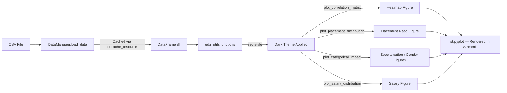

# 📊 Dashboard Overview — Campus Placement Predictor

This document explains every visual panel in the **Dashboard (EDA)** page of the Streamlit app, including how each chart is generated, what data it uses, and what insights it communicates.

---

## 🗂️ Page Layout

The dashboard is split into **two rows** of charts:

```
Row 1  ┌────────────────────────────┬──────────────────┬───────────────────┐
       │  📊 Performance Insights   │ 🧬 Placement Ratio│ 💼 Job Specialisation│
       │  (Correlation Heatmap)     │ (Count Plot)      │ (Count Plot)       │
       │  col ratio: 2              │ col ratio: 1      │ col ratio: 1       │
       └────────────────────────────┴──────────────────┴───────────────────┘

Row 2  ┌──────────────────────────────┬─────────────────────────────────────┐
       │  💰 Expected Package          │  ⚧ Gender Diversity                 │
       │  (Salary Histogram + KDE)     │  (Count Plot by Gender)             │
       └──────────────────────────────┴────────────────────────────────────-┘
```

---

## 📊 Panel 1 — Performance Insights (Correlation Heatmap)

**Location:** Row 1, Column 1 (2× width)

### What it shows
A **full numeric feature correlation matrix** rendered as a colour-coded heatmap. Every numeric column in the dataset is correlated against every other column using Pearson's `r` coefficient.

### Implementation
```python
# src/eda_utils.py — plot_correlation_matrix()
def plot_correlation_matrix(df):
    numeric_df = df.select_dtypes(include=['float64', 'int64'])
    corr = numeric_df.corr()
    sns.heatmap(corr, annot=True, cmap='mako', fmt='.2f',
                linewidths=0.5, cbar_kws={"shrink": .8})
```

| Setting | Value | Reason |
|---|---|---|
| `cmap` | `'mako'` | Dark-to-light perceptually uniform palette matching the dark theme |
| `annot=True` | Shows `r` value inside each cell | Enables precise reading without hovering |
| `fmt='.2f'` | 2 decimal places | Readable without clutter |
| `linewidths=0.5` | Thin grid lines | Separates cells cleanly |
| Figure size | `(12, 10)` | Large footprint to retain cell readability |

### Key Correlations to Cite in Viva

| Feature Pair | Expected `r` | Insight |
|---|---|---|
| `ssc_p` ↔ `hsc_p` | ~0.65 | Strong — prior academic consistency persists |
| `degree_p` ↔ `mba_p` | ~0.50 | Moderate — degree grades carry forward |
| `salary` ↔ `mba_p` | ~0.35 | Salary weakly linked to MBA score alone |
| `etest_p` ↔ `salary` | ~0.25 | Employability score has modest salary impact |

> **Viva tip:** The heatmap shows **multicollinearity** between academic scores. This is why Logistic Regression's `C` regularisation parameter matters — it prevents coefficient blow-up from correlated inputs.

---

## 🧬 Panel 2 — Placement Ratio

**Location:** Row 1, Column 2

### What it shows
A **count bar chart** of `Placed` vs `Not Placed` students showing the raw class distribution in the dataset.

### Implementation
```python
# src/eda_utils.py — plot_placement_distribution()
def plot_placement_distribution(df):
    colors = ['#5E6AD2', '#8A8F98']   # indigo = Placed, grey = Not Placed
    sns.countplot(x='status', data=df, palette=colors)
```

| Setting | Value | Reason |
|---|---|---|
| `x='status'` | The target label column | Direct visualisation of class balance |
| `palette` | `['#5E6AD2', '#8A8F98']` | Brand accent for placed, muted grey for not-placed |

### MBA Dataset Statistics

| Class | Count | Ratio |
|---|---|---|
| Placed | ~148 | ~68% |
| Not Placed | ~67 | ~32% |

### Engineering Dataset Statistics

| Class | Count | Ratio |
|---|---|---|
| Placed | varies | ~60–70% |
| Not Placed | varies | ~30–40% |

> **Viva tip:** The slight class imbalance (~2:1 placed vs not-placed) is why you should evaluate the model with **F1-score** in addition to accuracy. A naive classifier guessing "Placed" every time would already achieve ~68% accuracy.

---

## 💼 Panel 3 — Job Specialisation

**Location:** Row 1, Column 3

### What it shows
A **stacked count bar chart** showing how **MBA Specialisation** (`Mkt&HR` vs `Mkt&Fin`) or **Engineering Stream** (CSE, ECE, etc.) correlates with placement outcome.

### Implementation
```python
# src/eda_utils.py — plot_categorical_impact()
def plot_categorical_impact(df, col):
    sns.countplot(x=col, hue='status', data=df,
                  palette=['#5E6AD2', '#2a2a2e'])
```

The column rendered depends on the selected **Intelligence Mode**:

```python
# app.py
cat_col = 'specialisation' if domain_mode == 'MBA' else 'Stream'
fig4 = plot_categorical_impact(df, cat_col)
```

| Mode | Column Used | Categories |
|---|---|---|
| MBA | `specialisation` | `Mkt&HR`, `Mkt&Fin` |
| Engineering | `Stream` | CSE, ECE, ME, IT, … |

### Key Insight
- `Mkt&Fin` (Marketing & Finance) students tend to have slightly higher placement rates and salary packages.
- In Engineering, **CSE** and **IT** streams show the highest placement ratios.

> **Viva tip:** This chart demonstrates why `specialisation` / `Stream` is included as a feature in the model — it carries **categorical predictive power** for placement status.

---

## 💰 Panel 4 — Expected Package

**Location:** Row 2, Column 1

### What it shows
A **histogram with KDE (Kernel Density Estimate)** overlay showing the salary distribution of **only placed students**.

### Implementation
```python
# src/eda_utils.py — plot_salary_distribution()
def plot_salary_distribution(df):
    placed_df = df[df['status'] == 'Placed']
    sns.histplot(placed_df['salary'], kde=True,
                 color='#5E6AD2', alpha=0.6)
```

| Setting | Value | Reason |
|---|---|---|
| Filter | `status == 'Placed'` | Salary is only meaningful for placed students |
| `kde=True` | Smooth density curve | Shows underlying distribution shape beyond raw bins |
| `alpha=0.6` | Semi-transparent bars | Lets KDE curve remain visible |

### Observation
The salary distribution is typically **right-skewed** — most placed students cluster around a median, with a long tail of high-salary outliers. This is why the **salary prediction model (Random Forest)** outperforms linear regression on this data.

> **Viva tip:** "Not Placed" rows have `salary = 0` (filled by `DataManager`). The filter `df[df['status'] == 'Placed']` is essential to avoid a massive spike at ₹0 distorting the chart.

> **Note:** This panel shows `"Salary data not available"` in **Engineering mode** since the Engineering dataset does not include a salary column.

---

## ⚧ Panel 5 — Gender Diversity

**Location:** Row 2, Column 2

### What it shows
A **grouped count bar chart** showing placement outcomes split by **gender** (`Male`/`Female` for Engineering, `M`/`F` for MBA).

### Implementation
```python
# app.py
fig2 = plot_categorical_impact(
    df,
    'Gender' if domain_mode == 'Engineering' else 'gender'
)
```

Reuses the same `plot_categorical_impact()` function from Panel 3, but with the gender column:

| Mode | Column | Values |
|---|---|---|
| MBA | `gender` | `M`, `F` |
| Engineering | `Gender` | `Male`, `Female` |

### Key Insight
- In both datasets, **male students are more numerous** (dataset composition, not a model bias).
- Placement *rates* across genders are relatively comparable, though slight variations exist.

> **Viva tip:** Gender is included as a feature in both models. Its predictive contribution is small but measurable. The chart helps identify **dataset representation bias** which should be disclosed in any real-world deployment.

---

## 🎨 Shared Design System

All charts share a unified dark-theme aesthetic set by `set_style()` in `eda_utils.py`:

```python
def set_style():
    plt.style.use('dark_background')
    sns.set_theme(style="whitegrid", rc={
        'axes.facecolor': '#050506',    # near-black canvas
        'figure.facecolor': '#050506',
        'grid.color': '#1a1a1e',        # very subtle grid
        'text.color': '#EDEDEF',        # off-white text
        'axes.labelcolor': '#8A8F98',   # muted label grey
        'axes.edgecolor': '#1a1a1e',
    })
    plt.rcParams['figure.dpi'] = 120   # high resolution output
```

| Token | Hex | Usage |
|---|---|---|
| Background | `#050506` | Canvas & figure background |
| Accent | `#5E6AD2` | Primary bars, placed class, KDE fill |
| Muted | `#8A8F98` | Labels, secondary bars, axis text |
| Grid | `#1a1a1e` | Subtle horizontal grid lines |
| Text | `#EDEDEF` | Titles and annotations |

---

## 🔁 Data Flow to Dashboard



---

## 📌 Dashboard Quick-Reference Card

| Panel | Chart Type | Function | Column(s) Used | Mode |
|---|---|---|---|---|
| Performance Insights | Correlation Heatmap | `plot_correlation_matrix` | All numeric | Both |
| Placement Ratio | Count Bar | `plot_placement_distribution` | `status` | Both |
| Job Specialisation | Grouped Count Bar | `plot_categorical_impact` | `specialisation` / `Stream` | Switches |
| Expected Package | Histogram + KDE | `plot_salary_distribution` | `salary` (placed only) | MBA only |
| Gender Diversity | Grouped Count Bar | `plot_categorical_impact` | `gender` / `Gender` | Switches |

---

*Dashboard documentation for ML Lab Project — Campus Placement Predictor* 🚀
