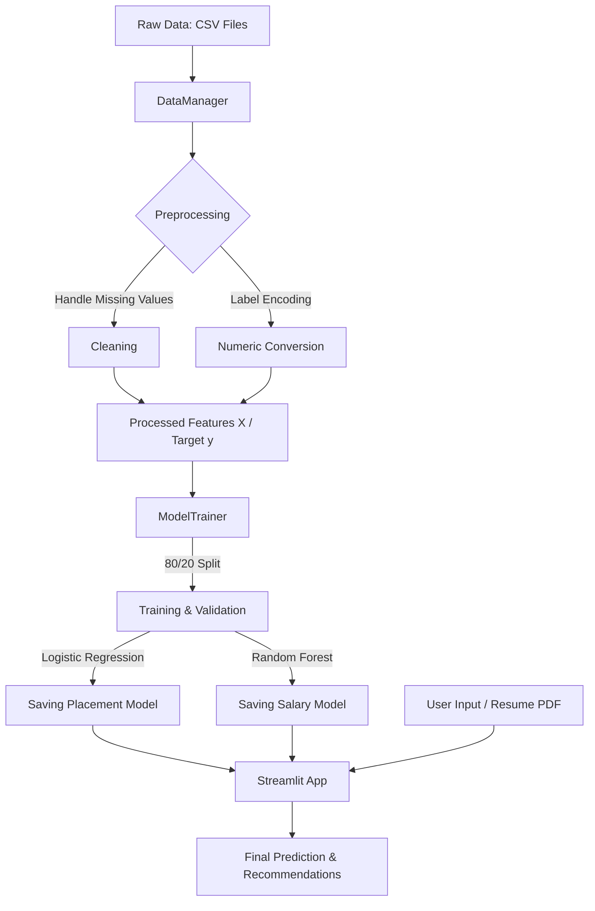
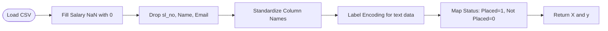
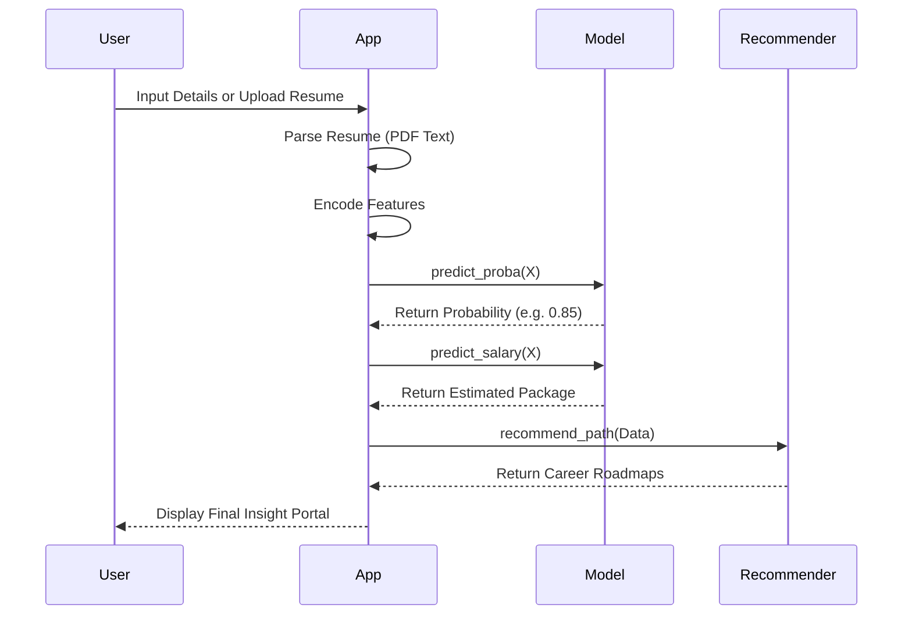

# 🗺️ System Architecture & Data Flow

This document provides a visual representation of how the Campus Placement Predictor works, from data loading to real-time prediction.

---

## 🔁 Overall System Pipeline

---

## 🛠️ Data Preprocessing Flow

---

## 🎯 Prediction & Recommendation Logic

---

## 📊 Dashboard & Analytics Flow

1.  **Exploratory Data Analysis (EDA):** Uses Seaborn and Matplotlib to generate real-time charts.
2.  **Benchmarking:** Calculates the mean of `ssc_p`, `hsc_p`, etc., from the **Placed** subset and calculates the student's percentile.
3.  **What-If Analysis:** Adjusts a single feature value, re-runs the model prediction, and calculates the `gain` in probability.

---
*Visual Guide for ML Project Architecture* 🚀
